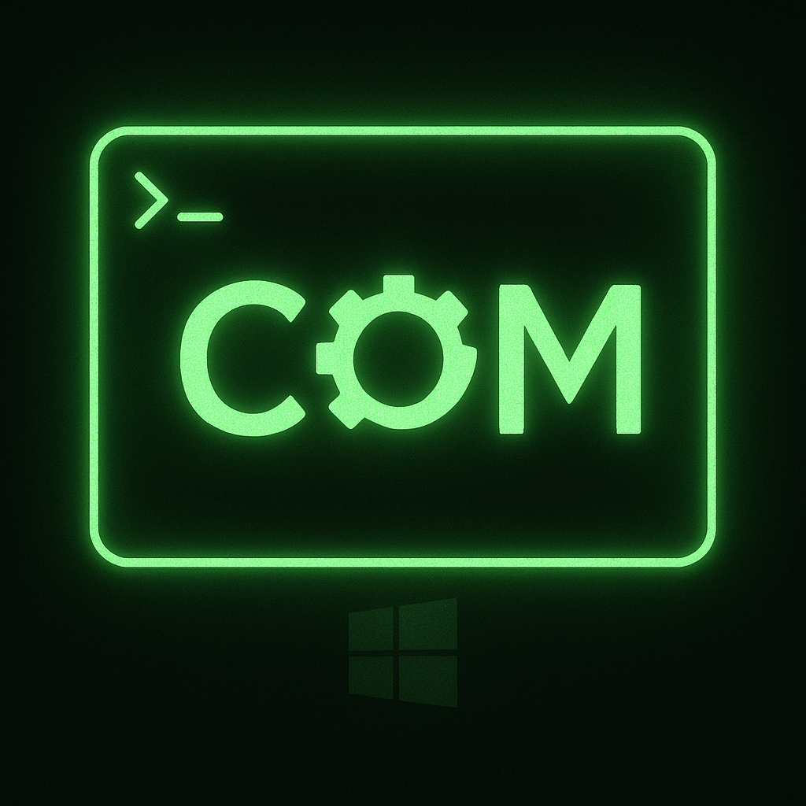

# RustCOM Explorer



A high-performance, terminal-based explorer for Windows COM (Component Object Model) and ActiveX objects. Designed for system integrators, SCADA engineers, and developers who need to inspect legacy and modern Windows components without the overhead of heavy GUI tools.

[](LICENSE)
[](https://www.microsoft.com/windows)
[](https://www.rust-lang.org/)
[](https://github.com/mberetvas/RustCom-explorer/actions/workflows/release.yml)

## 🧐 Overview

RustCOM Explorer provides a modern TUI (Text User Interface) to browse, search, and inspect registered COM objects on your Windows system. Unlike traditional tools like OLEView, it prioritizes safety by inspecting Type Libraries in the Registry before attempting instantiation, runs entirely in the terminal, and supports fuzzy searching.

For automation tasks, it includes a multi-threaded CLI mode capable of deep-inspecting thousands of objects in seconds using parallel processing.

## ✨ Features

- **🚀 High Performance**: Built with Rust for instant startup and low memory footprint.
- **⚡ Parallel Deep Inspection**: Utilizes a global thread pool to inspect thousands of objects concurrently during JSON export.
- **🛡️ Safety First**: Inspection logic prefers `LoadRegTypeLib` to avoid side effects. Optional "Unsafe Mode" allows dynamic instantiation (`CoCreateInstance`) for stubborn objects.
- **🔍 Fuzzy Search**: Real-time filtering of objects by Name, CLSID, or Description.
- **📋 Developer Ready**: Copy method signatures (C++, C#, Rust style) directly to the clipboard.
- **💻 Dual Mode**: Full interactive TUI for exploration and CLI for scripting/exporting.

## 🚀 Getting Started

### Prerequisites

- **Operating System**: Windows 10 or Windows 11 (Required for Win32 COM API).
- **Toolchain**: [Rust](https://www.rust-lang.org/tools/install) 1.75 or later.

### Installation

Clone the repository and build the project using Cargo:

```bash
git clone https://github.com/Volvo/comm_browser.git
cd comm_browser
cargo build --release
```

The executable will be located at `./target/release/rustcom_explorer.exe`.

> [!NOTE]
> Some system-level COM objects require Administrator privileges to be visible or inspected. For best results, run your terminal as Administrator.

## 📖 Usage

### Interactive TUI Mode

Simply run the application without arguments to enter the interactive interface:

```bash
./rustcom_explorer.exe
```

**Navigation Controls:**

| Key | Action |
| :--- | :--- |
| `↑` / `↓` | Navigate list or menu items |
| `Enter` | Expand Category / Inspect Object |
| `Esc` | Back / Clear Search |
| `Type` | Fuzzy search filter |
| `c` | Copy selected member signature |
| `Shift + C` | Copy all members to clipboard |
| `Ctrl + C` | Quit |

### CLI / Automation Mode

Use the `list` command to generate reports or export data for processing.

**Generate a Text Report:**
```bash
rustcom_explorer.exe list --output report
```

**Filter and Export to JSON:**
This command runs a deep inspection on all matching objects. Progress is parallelized across all CPU cores.
```bash
rustcom_explorer.exe list --filter "Excel" --json --output excel_data
```

**Enable Unsafe Instantiation:**
If an object doesn't have a registered Type Library, use `--unsafe` to allow the tool to instantiate it to retrieve type info.
```bash
rustcom_explorer.exe list --unsafe --json --output full_dump
```

**Verbose Output:**
Use `--verbose` to print additional information during CLI operations.
```bash
rustcom_explorer.exe list --verbose --output report
```

## 🏗️ Architecture

The project is structured to ensure stability even when interacting with unstable legacy components.

- **Registry Scanning**: Iterates `HKEY_CLASSES_ROOT` to build an initial index of `ProgID`s and `CLSID`s.
- **COM Interop**: Uses the `windows` crate for low-level interaction.
    - **Safe Path**: Attempts to load `ITypeLib` directly from the registry.
    - **Unsafe Path**: Falls back to `CoCreateInstance` + `IDispatch` if explicitly allowed.
- **Parallelism**: The CLI mode configures a custom `rayon` thread pool where every worker thread initializes COM (`CoInitializeEx`) independently, allowing for massive concurrency during deep inspection tasks.

## ⚠️ Limitations

- **Platform**: Strictly Windows-only due to dependency on the Win32 API.
- **Permissions**: Inspection of certain administrative objects will fail without elevated privileges.
- **Registry Pollution**: The tool relies on the Registry being relatively clean. "Ghost" keys from uninstalled software may appear in the list but fail inspection.